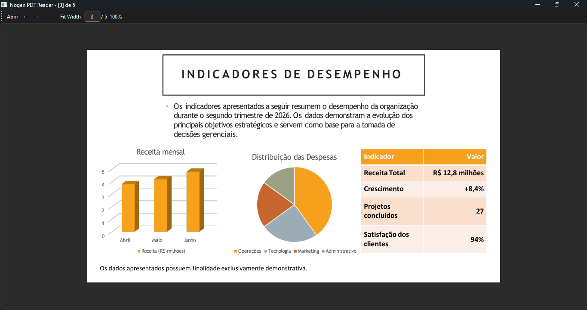

# 📄 Nogen PDF Reader


Um leitor de PDF simples desenvolvido em Python utilizando interface gráfica com PySide6 e renderização de páginas com PyMuPDF.

## 🚀 Sobre o projeto

O **Nogen PDF Reader** é um aplicativo desktop que permite abrir e visualizar arquivos PDF de forma prática, com navegação entre páginas e suporte a zoom.

O projeto surgiu como uma iniciativa de aprendizado e evoluiu para um leitor de PDF de código aberto, desenvolvido em Python, com foco em simplicidade, desempenho e evolução contínua.

## Demonstração



## 🧰 Tecnologias utilizadas

- Python
- PySide6 (interface gráfica)
- PyMuPDF (fitz) para leitura e renderização de PDFs

## ✨ Funcionalidades

- 📂 Abertura de arquivos PDF
- 📑 Histórico de arquivos recentes
- 📄 Navegação entre páginas
- 🔢 Campo para navegação direta por número da página
- 🔍 Zoom por botões (+ e -)
- ⌨️ Zoom por porcentagem editável
- 🖱️ Zoom com `Ctrl + roda do mouse`
- ↔️ Fit Width (ajuste à largura da janela)
- 🖼️ Fit Page (ajuste da página inteira à janela)
- 💾 Memorização automática do último documento aberto
- 📍 Restauração da última página visualizada
- 🔄 Restauração do último nível de zoom

## 🚧 Roadmap

### Concluído

- ✅ Navegação entre páginas
- ✅ Zoom
- ✅ Campo de zoom editável
- ✅ Memória da última leitura
- ✅ Fit Width
- ✅ Fit Page
- ✅ Manual do usuário

### Planejado

- 📂 Histórico de arquivos recentes
- 🔍 Pesquisa em documentos
- 🖼️ Miniaturas de páginas

## 🎮 Controles

- **Abrir PDF**: botão "Abrir"
- **Próxima página**: botão "→" ou tecla seta direita
- **Página anterior**: botão "←" ou tecla seta esquerda
- **Zoom in**: botão "+"
- **Zoom out**: botão "-"
- **Os botões Fit Page e Fit Width são controles diferentes, portanto, podem ser ativados nas caixas de seleção.**

## ▶️ Como executar

1. Instale as dependências:
```bash
pip install -r requirements.txt
```

Ou pelo modo convencional:

```bash
pip install PySide6 PyMuPDF
```

2. Execute o arquivo principal:
```bash
python main.py
```

## 💻 Compatibilidade

| Sistema Operacional | Status |
|---------------------|--------|
| Windows 10/11 | ✅ |
| Windows 7/8/8.1 (Legacy) | 🧪 |
| Linux Mint 22.3 | ✅ |
| Debian 13 | ✅ |
| Zorin OS 18 | ✅ |
| Ubuntu | 🧪 |

## 📌 Observações

Este projeto foi criado com fins educacionais e continua sendo aprimorado como parte do aprendizado em desenvolvimento de software.

## 📄 Documentação

- Manual do usuário
- Relatório de demonstração

## 🌱 Filosofia do projeto

O Nogen PDF Reader busca oferecer uma experiência simples, leve e eficiente para leitura de documentos PDF.

O projeto é desenvolvido como software livre, priorizando código limpo, compatibilidade entre plataformas e evolução contínua.
